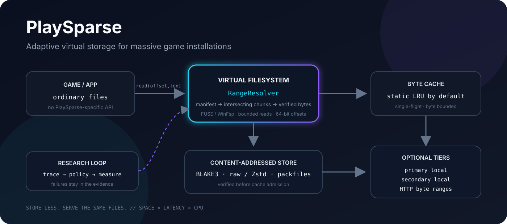
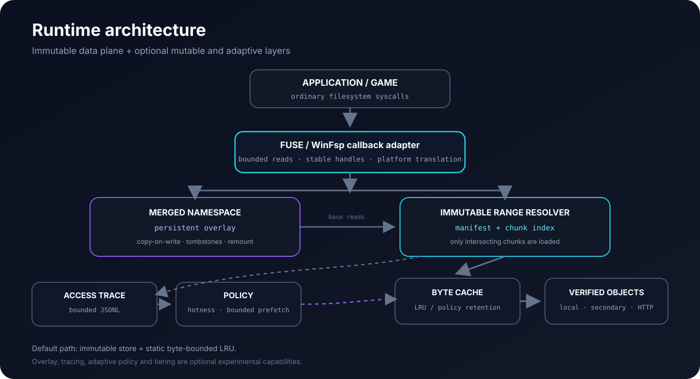
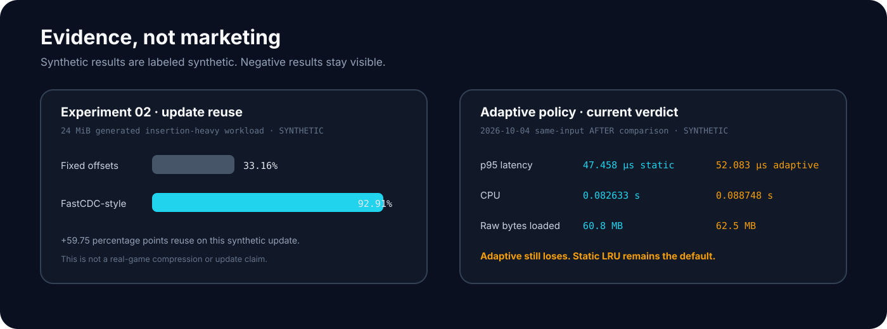

<p align="center">
  
</p>

<h1 align="center">PlaySparse</h1>

<p align="center">
  <strong>Adaptive virtual storage for massive game installations.</strong><br>
  Store less. Serve the same files.
</p>

<p align="center">
  <a href="https://github.com/gogolumo/PlaySparse/actions/workflows/rust-runtime.yml"></a>
  <a href="https://github.com/gogolumo/PlaySparse/actions/workflows/ci.yml"></a>
  
  <a href="LICENSE"></a>
  
</p>

<p align="center">
  <a href="#quick-start">Quick start</a> ·
  <a href="#how-it-works">How it works</a> ·
  <a href="#status">Status</a> ·
  <a href="#benchmarks--evidence">Benchmarks</a> ·
  <a href="#roadmap">Roadmap</a> ·
  <a href="#documentation">Docs</a>
</p>

> [!IMPORTANT]
> PlaySparse is **not** claiming arbitrary 10×–15× lossless compression for already-compressed game assets. The project explores a different storage representation: chunked, compressed, verified objects served through a virtual filesystem while applications continue reading ordinary files.

## What is PlaySparse?

Modern games can occupy enormous amounts of storage, but simply turning the compression level up is not a solution. Assets may already be compressed, random reads still need low latency, updates can shift large regions of data, and decompression consumes CPU.

PlaySparse investigates whether an unmodified application can keep seeing the normal filesystem it expects while the physical representation underneath is more flexible: **content-addressed chunks, Zstd/raw objects, indexed packfiles, bounded caches, tracing, writable overlays and optional local/HTTP tiers**.

The goal is not maximum compression at any cost. The goal is a better **space × latency × CPU** frontier without requiring the application to understand PlaySparse.

## How it works

<p align="center">
  
</p>

A read such as `Data/Textures/world_03.pak` at a particular byte range follows a bounded path:

1. the mounted filesystem receives the application's normal read request;
2. `RangeResolver` finds only the manifest chunks intersecting that range;
3. the byte-bounded cache is checked;
4. missing objects are resolved from verified local, secondary-local or HTTP sources;
5. raw/Zstd objects are bounded, decompressed when required and verified by BLAKE3;
6. the requested bytes are returned through FUSE or WinFsp.

Optional tracing records access patterns. An experimental policy can alter cache retention and bounded sequential prefetch, but **static LRU remains the default because the current adaptive benchmark does not beat it**.

### Storage pipeline

```text
source directory
      │
      ▼
 content-defined chunking
      │
      ▼
 BLAKE3-256 object IDs
      │
      ▼
 raw / Zstd objects
      │
      ▼
 indexed packfiles + manifest
      │
      ▼
 RangeResolver + bounded cache
      │
      ▼
 virtual mounted filesystem
```

The production read path does not reconstruct whole files before serving a range.

## Status

PlaySparse is **experimental systems research**, not production-ready game storage software.

| Capability | Current evidence | Status |
|---|---|---|
| Immutable v1 CAS, BLAKE3 verification, raw/Zstd objects | Rust implementation and correctness tests | ✅ Working |
| Indexed packfiles and deterministic manifest | Default production layout with loose-object baseline retained | ✅ Working |
| Byte-range reads | Binary-search range resolver loads only intersecting chunks | ✅ Working |
| Linux virtual filesystem | Real FUSE mounts in Linux VM/hosted CI, including 10 GiB offsets, mmap and executable reads | ✅ Software validated |
| Windows virtual filesystem | Native WinFsp mounts validated in hosted CI and on physical Windows 11 x64 hardware | ✅ Physical hardware validated |
| macOS backend | Signed macFUSE 5.4.0 SDK compile/link/tests pass | ✅ Backend validated |
| Native mounted macOS runtime | Native Apple Silicon macFUSE 5.4.0 mount/read/unmount plus readonly/writable/adaptive/tiered validation | ✅ Software validated |
| Persistent writable overlay | Create/write/rename/remount/commit/discard tested with generated updater | 🧪 Experimental |
| Tracing + adaptive cache/prefetch | Functional and reproducible, but current synthetic comparison loses to static LRU | 🧪 Experimental |
| Secondary local + HTTP tiers | Verified promotion, offline promoted reads, exact HTTP ranges and corruption failure paths | 🧪 Experimental |
| Physical Linux/Windows performance | Windows warm-read measurements captured on physical hardware; physical Linux evidence still required | 🧪 Windows measured |
| Real-game filesystem compatibility | Elden Ring reached the main menu on Windows; Project Zomboid reached live single-player gameplay on macOS through a hybrid PlaySparse/APFS runtime | 🧪 Two owned workloads validated |

### Platform matrix

| Platform | Build | Virtual mount | CI evidence | Physical validation | Real game |
|---|---|---|---|---|---|
| macOS arm64 | ✅ | ✅ macFUSE 5.4.0 | ✅ SDK + native mounted validation | ✅ native Apple Silicon generated-fixture validation | ✅ Project Zomboid hybrid runtime; live gameplay |
| Linux | ✅ | ✅ FUSE | ✅ mounted validation | Hardware required | Not run |
| Windows | ✅ | ✅ WinFsp | ✅ hosted Server validation | ✅ Windows 11 x64 physical hardware | ✅ Elden Ring executable path; launcher/DRM/EAC not tested |

Hosted CI is not treated as equivalent to a physical gaming desktop. Physical Windows testing exists for one owned Elden Ring workload, and native Apple Silicon testing now includes one owned Project Zomboid gameplay workload through a hybrid PlaySparse/APFS compatibility runtime. Neither result establishes universal game, launcher, DRM, anti-cheat or multiplayer compatibility. See the [physical Windows / Elden Ring report](docs/evidence/windows-physical-elden-ring-2026-10-05.md) and the [macOS / Project Zomboid report](docs/evidence/macos-project-zomboid-2026-10-05.md).

## Quick start

PlaySparse uses the Rust toolchain pinned in [`rust-toolchain.toml`](rust-toolchain.toml). The validation helpers also use Python 3.9+.

### Build

```bash
git clone https://github.com/gogolumo/PlaySparse.git
cd PlaySparse

cargo build --locked --release --workspace
./target/release/playsparse doctor --human
```

### Analyze, pack and verify a directory

Keep the source directory read-only and write the PlaySparse store somewhere else.

```bash
./target/release/playsparse analyze ./TestGame
./target/release/playsparse pack ./TestGame ./TestGame.playsparse
./target/release/playsparse verify ./TestGame.playsparse
```

The default Rust pack path uses content-defined chunks, indexed packfiles and Zstd level 3, retaining raw objects when compression would make an object larger.

### Experimental game-aware analysis

Optional engine discovery and measured file probes can produce a reviewed packing
plan. Universal-modder is an optional read-only detector; the mounted runtime has
no dependency on it. Profiles retain Zstd by default, and ZIP record boundaries
are an explicit experiment. Bounded-sample compression skipping has a retained
negative result and requires an additional experimental opt-in.

```bash
./target/release/playsparse inspect-game ./TestGame --scanner generic \
  --output game-profile.json --plan-output packing-plan.json --container-aware
./target/release/playsparse analyze ./TestGame --profile game-profile.json
./target/release/playsparse pack ./TestGame ./TestGame.playsparse --plan packing-plan.json
```

See [game-aware storage](docs/game-awareness.md), the [audit](docs/game-awareness-audit.md)
and [experiment 05](experiments/05-game-aware-packing/README.md). Engine recognition
does not establish a compression advantage or real-game compatibility.

### Mount on Linux

Linux needs an accessible `/dev/fuse` plus `fusermount3` or `fusermount`.

```bash
mkdir ./mounted

./target/release/playsparse mount \
  ./TestGame.playsparse \
  ./mounted \
  --cache 256M
```

In another terminal, ordinary programs can read the virtual tree:

```bash
cat ./mounted/readme.txt
./target/release/playsparse unmount ./mounted
```

For the canonical mounted validation suite:

```bash
python3 tools/posix-runtime-validation.py \
  --work /tmp/playsparse-linux-01 \
  --build
```

See the [POSIX validation guide](docs/posix-validation.md) for prerequisites and evidence interpretation.

### macOS

Without installing a driver, the repository can verify and compile against the signed macFUSE SDK:

```bash
python3 tools/macos-sdk-check.py \
  --work /tmp/playsparse-macos-sdk-01
```

A real mount requires supported macFUSE 5.3.3+ in the 5.x series, kernel-extension approval/restart, and a `macfuse` build. **FSKit is not supported by the current backend.**

```bash
cargo build --locked --release --workspace --features macfuse

python3 tools/posix-runtime-validation.py \
  --work /tmp/playsparse-macos-01 \
  --build
```

Native Apple Silicon validation has now passed with macFUSE 5.4.0: the disposable doctor probe mounts, reads exact bytes from a different filesystem device, unmounts cleanly, and the full POSIX suite passes readonly, writable, adaptive and tiered generated-fixture stages. This is mounted-runtime evidence, not real-game or launcher compatibility evidence.

### Windows

The Windows backend uses WinFsp. Native hosted validation covers readonly, writable, adaptive and tiered flows. Physical Windows 11 x64 validation has also passed those stages on real hardware, and an Elden Ring executable launched from the mounted representation, reached the main menu, remained running normally and exited normally. That test covers filesystem compatibility for the tested executable path only; Steam launcher integration, DRM, Easy Anti-Cheat and protected multiplayer were not tested.

See [`docs/windows-backend.md`](docs/windows-backend.md), [`docs/windows-comparison.md`](docs/windows-comparison.md) and the [2026-10-05 physical Windows / Elden Ring report](docs/evidence/windows-physical-elden-ring-2026-10-05.md).

## Benchmarks & evidence

PlaySparse is measurement-first. A technique is interesting only if it produces a reproducible, non-dominated improvement against meaningful baselines.

<p align="center">
  
</p>

### Update reuse: promising, but synthetic

Experiment 02 uses a generated 24 MiB insertion-heavy update workload:

| Chunking | v2 bytes reusing v1 chunks | Compressed unique store / two versions |
|---|---:|---:|
| Fixed offsets | ~33.16% | ~16.86% |
| FastCDC-style | ~92.91% | ~10.89% |

CDC recovered content boundaries after insertion and improved reuse by about **59.75 percentage points** on that synthetic workload. It is evidence for the storage behavior, **not** a claim about GTA, Dota, Steam or any other real game.

See [`experiments/02-fixed-vs-fastcdc`](experiments/02-fixed-vs-fastcdc).

### Adaptive policy: the current result is negative

The 2026-10-04 same-input `AFTER` comparison used three trials per mode with the same sealed store, trace and 4 MiB PlaySparse cache:

| Median of three trials | Static | Adaptive |
|---|---:|---:|
| p95 latency | **47.458 µs** | 52.083 µs |
| Process CPU | **0.082633 s** | 0.088748 s |
| Raw bytes loaded | **60,817,408** | 62,521,344 |
| Prefetch wasted bytes | 0 | **0** |

The newer admission logic eliminated measured prefetch waste on this trace, but adaptive still lost on p95 latency, CPU and raw bytes loaded. **Static LRU remains the default.**

See [`docs/evidence/production-readiness-policy.md`](docs/evidence/production-readiness-policy.md).

> [!NOTE]
> **Negative results stay.** PlaySparse does not turn a passing implementation into a performance claim. Failed optimizations, limitations and blocked hardware gates remain part of the evidence trail.

### Physical Windows + Elden Ring: first real-game evidence

A physical Windows 11 x64 run at tested revision `7783946b1bde21f78a40ac6711bab3e47caedf65` passed build, doctor, readonly, writable, adaptive and tiered validation with real WinFsp mounts. An owned Elden Ring installation also launched through the tested PlaySparse path, reached the main menu, remained running normally and exited normally.

For that ~66.36 GiB installation:

| Representation | Allocated | Saving vs original |
|---|---:|---:|
| Original | ~66.36 GiB | — |
| WOF XPRESS4K | ~66.29 GiB | ~0.06 GiB |
| PlaySparse CDC | ~64.21 GiB | ~2.15 GiB (~3.2%) |

The full analyzer measured ~1.58 GiB of CDC duplicate reuse, while ~57.29 GiB of unique raw input was not beneficially compressed by the current generic codec. That makes archive/container structure—especially the large `.bdt` files—the main next storage research target rather than simply raising the compression level.

The read comparison was a **warm workload**, not a disk-cold benchmark: mean wall time was ~49.6 ms original, ~52.3 ms WOF and ~57.2 ms PlaySparse for the tested trials.

See the [full physical Windows / Elden Ring validation and storage analysis](docs/evidence/windows-physical-elden-ring-2026-10-05.md).

### macOS + Project Zomboid: L2 gameplay evidence

On native Apple Silicon macOS, an owned Project Zomboid installation was packed, verified and run through a hybrid PlaySparse runtime. macOS-signed native/runtime code plus selected path-sensitive resources were materialized into a small APFS shadow, while large game assets continued to be served from the compressed PlaySparse store through macFUSE.

The tested session progressed beyond launch and the main menu: a new character and world were created, the world loaded, live single-player gameplay ran normally, ordinary interactions were performed, save activity occurred and the game exited normally.

Measured allocated footprint:

| Representation | Allocated |
|---|---:|
| Original installation | 10,163.27 MiB |
| PlaySparse store | 4,948.25 MiB |
| APFS compatibility shadow | 869.80 MiB |
| **Effective PlaySparse runtime** | **5,818.05 MiB** |

That is **4,345.23 MiB saved, or 42.75% less allocated storage**, for this specific title/host/configuration.

The experiment also isolated two macOS compatibility requirements for productization: runtime-loaded signed native code may need APFS materialization on this host, and the current POSIX namespace does not yet emulate case-insensitive APFS lookup. The result is therefore recorded as a **hybrid-runtime L2 validation**, not universal direct-FUSE compatibility.

See the [full macOS / Project Zomboid validation report](docs/evidence/macos-project-zomboid-2026-10-05.md).

### Reproducible evidence

The repository retains evidence for:

- generated 10 GiB reads beyond 4/8 GiB, mmap and concurrent I/O;
- Linux FUSE mounted readonly/writable/adaptive/tiered stages;
- native Apple Silicon macFUSE readonly/writable/adaptive/tiered stages;
- hosted Windows WinFsp readonly/writable/adaptive/tiered stages;
- physical Windows 11 x64 WinFsp validation and one owned Elden Ring executable workload;
- native Apple Silicon macFUSE validation and one owned Project Zomboid hybrid-runtime gameplay workload;
- corruption and ENOSPC failure handling;
- loose objects vs indexed packfiles;
- source/base fingerprints and command provenance;
- unsuccessful experiments and regression reproductions.

Start with [`docs/evidence/production-readiness.md`](docs/evidence/production-readiness.md) and the raw evidence under [`docs/evidence/`](docs/evidence/).

## Architecture

The Rust workspace separates storage, range serving, caching, filesystem adapters and policy logic instead of hiding them behind one monolith.

| Area | Workspace component |
|---|---|
| Storage primitives / shared types | `playsparse-core`, `playsparse-store` |
| Byte-range serving | `playsparse-range` |
| Bounded object cache | `playsparse-cache` |
| CLI | `playsparse-cli` |
| Linux/macOS virtual filesystem | `playsparse-vfs-fuse` |
| Windows virtual filesystem | `playsparse-vfs-win` |
| Access tracing | `playsparse-trace` |
| Writable copy-on-write layer | `playsparse-overlay` |
| Experimental adaptive policy | `playsparse-policy` |
| Independent I/O comparison | `io-probe` |

The immutable v1 store remains the data plane. Overlay, tracing, adaptive policy and tiers sit above or beside it. See [`docs/architecture-v2.md`](docs/architecture-v2.md) and [`docs/storage-format-v1.md`](docs/storage-format-v1.md).

## Why this is not just filesystem compression

PlaySparse does not claim novelty for Zstd, FastCDC, content-addressed storage, FUSE, WinFsp, WOF or transparent filesystem compression.

The research hypothesis is the **control loop** around those known primitives:

- keep application-visible files ordinary;
- choose a chunked physical representation underneath;
- observe real byte-range access;
- cache and prefetch within explicit bounds;
- reuse content across versions;
- resolve verified objects from different storage tiers;
- measure every candidate against space, tail latency, CPU, RAM and amplification.

The project only earns a stronger claim when it beats meaningful baselines under the criteria in [`docs/breakthrough-criteria.md`](docs/breakthrough-criteria.md). Prior-art notes live in [`docs/prior-art.md`](docs/prior-art.md).

## Roadmap

| Phase | State | Next proof |
|---|---|---|
| Rust storage format + range resolver | ✅ | Broader fault injection / durability |
| Linux FUSE + macOS macFUSE + Windows WinFsp software paths | ✅ / 🟡 | Physical Linux desktop validation; broaden physical Windows workloads |
| Writable overlay, tracing and storage tiers | 🧪 | Representative application workloads |
| Adaptive cache/prefetch policy | 🧪 | Reproducible non-dominated win vs static baselines |
| Representative workloads | 🔬 | L1 open game-like → L2 owned real game → L3 replication |
| Productization | Future | Only after correctness and benchmark gates justify it |

The detailed milestone history and acceptance criteria are in [`ROADMAP.md`](ROADMAP.md).

## Documentation

| Area | Guides |
|---|---|
| **Architecture** | [Architecture v2](docs/architecture-v2.md) · [Storage format v1](docs/storage-format-v1.md) |
| **Runtime** | [POSIX validation](docs/posix-validation.md) · [FUSE backend](docs/fuse-backend.md) · [Windows backend](docs/windows-backend.md) · [Windows comparison](docs/windows-comparison.md) |
| **Mutable layer** | [Writable overlay](docs/writable-overlay.md) |
| **Observability & policy** | [Access tracing](docs/access-tracing.md) · [Adaptive policy](docs/adaptive-policy.md) |
| **Tiering** | [Tiered storage](docs/tiered-storage.md) |
| **Offline analysis** | [Game awareness](docs/game-awareness.md) · [Pre-code audit](docs/game-awareness-audit.md) |
| **Research standard** | [Breakthrough criteria](docs/breakthrough-criteria.md) · [Prior art](docs/prior-art.md) · [Limitations](docs/limitations.md) |
| **Evidence** | [Production readiness](docs/evidence/production-readiness.md) · [Adaptive/writable runtime](docs/evidence/adaptive-writable-runtime.md) · [macOS/Linux runtime](docs/evidence/posix-runtime.md) · [Physical Windows + Elden Ring](docs/evidence/windows-physical-elden-ring-2026-10-05.md) · [macOS + Project Zomboid](docs/evidence/macos-project-zomboid-2026-10-05.md) |

## Contributing

PlaySparse is a good fit for contributors interested in **Rust, filesystems, storage engines, benchmarking, FUSE/WinFsp, workload analysis and reproducible systems research**.

The project has a few non-negotiable rules:

- never claim a savings ratio without a reproducible dataset and benchmark;
- keep original test data read-only;
- retain negative results;
- describe synthetic data as synthetic;
- do not add DRM, anti-cheat, license-circumvention or piracy tooling.

Read [`CONTRIBUTING.md`](CONTRIBUTING.md) before submitting benchmark or architecture changes.

## Safety & legal scope

PlaySparse is experimental software and should not be pointed at irreplaceable data.

- source installations are treated as read-only inputs;
- packed stores and overlays live on separate paths;
- no DRM, anti-cheat or license-check bypass is in scope;
- commercial game assets are not committed to the repository;
- destructive source deletion is out of scope until reconstruction and crash safety are mature.

See [`SECURITY.md`](SECURITY.md).

## License

PlaySparse's own code is licensed under the [MIT License](LICENSE).

The Windows build also links GPL-3.0 WinFsp Rust bindings and uses the separately licensed WinFsp driver. Review the dependency notes in [`docs/windows-backend.md`](docs/windows-backend.md#dependency-licenses) before distributing a combined Windows executable.

---

<p align="center">
  <strong>Store less. Serve the same files.</strong><br>
  <sub>Measure first. Keep the failures. Earn the claim.</sub>
</p>