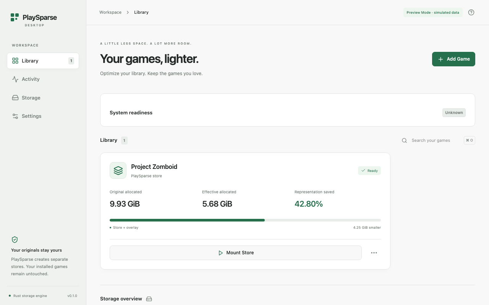

# PlaySparse Desktop

The native app uses the existing Rust engine for measured analysis, compressed stores, verification and filesystem mounts. The frontend is React/TypeScript in Tauri 2. The browser preview is explicitly simulated and cannot access installations, mount filesystems or launch games.



## Run

Use Rust 1.99 and Node 22.12+ (CI uses Node 24). From the repository root:

```sh
cd desktop
npm ci
npm run dev
```

Open http://127.0.0.1:1420 for **Preview Mode**. Reference game values and all preview operations are simulated. They are not new Project Zomboid measurements.

For the native application, stop the preview server first:

```sh
npm run tauri dev
```

This builds and bundles the actual `playsparse` runtime sidecar and starts Vite. Rust integration is direct for analysis, packing, verification and allocation. Only diagnostics, mount/unmount and configured game launches use literal process argument arrays; no shell commands are constructed from paths or launch descriptors.

## First-run readiness

Library and Settings show Ready, Action required, Unsupported or Unknown, the architecture/backend and safe driver guidance. **Run diagnostics again** refreshes passive facts. **Test mount readiness** runs the existing tiny disposable doctor mount/read/unmount probe on POSIX; it never installs or approves a driver. Only an actual passing probe reports Ready. A supported macFUSE installation alone remains Unknown because system approval/restart cannot be inferred. Windows DLL detection permits an attempt but driver usability remains Unknown until a real mount; the disposable doctor probe is currently POSIX only. Linux reports device access and discovered fusermount helpers in expandable technical details. Analysis/packing do not require a mount driver.

Use official [macFUSE kernel-backend guidance](https://github.com/macfuse/macfuse/wiki/Getting-Started), [WinFsp installation](https://winfsp.dev/rel/) and your distribution's FUSE 3 package/permission instructions. No world-writable device permissions or silent elevation are requested.

## First installation

Add Game opens a native folder chooser. The chosen folder is validated and inspected read-only before Add: title, regular-file count, logical bytes and conservative launch candidates are shown. Nonexistent paths, files, existing stores, app data and duplicate/overlapping installations are rejected. Discovery does not follow symlinks, scans at most 200,000 entries and 12 directory levels, and explicitly labels a partial inspection. Registering records only metadata. Analyze performs the existing full measured fixed/CDC comparison with two disposable, verified stores. Choose the store location from the optimization preview or Settings; choose temporary storage in Settings. Disk budgets are conservative estimates, not reservations. Analyze can take time and needs substantial temporary space.

Review & Optimize opens the measured preview. Packing creates a new independent store, verifies its staging data and publishes atomically. The library entry is registered as verified only after successful engine publication and database persistence. Stage and byte/file counters come from actual engine callbacks; progress is indeterminate where a reliable denominator is unavailable. Cancellation is cooperative between scan entries/chunks and verification reads. Preflight scans and individual filesystem operations are not interruptible. Cancellation is disabled before atomic publication.

Original installs remain on disk. **Representation savings are not reclaimed free disk space.** Allocation can be unavailable and is displayed as such. Store objects are shared within each store, not across stores. Effective representation sizes and savings include allocated store and writable-overlay bytes. Overlay allocation becomes unknown on mount and is measured again on ordinary unmount or Measure now; unknown values are not treated as zero. No compatibility shadow or persistent disk cache is configured. Application logs, library metadata and destination lock files are not included in game representation totals. Current storage measurements include overlays. Hardlinks/reflinks across installations are not deduplicated in totals; no aggregate claim of unique physical disk usage is made. Compatibility shadows are not configured by this app. Runtime caches use memory, not a persistent disk cache.

## Runtime

Mount Store is available after store verification and driver detection. Every mount re-verifies the store and checks actual mounted bytes before reporting Mounted. Writes go into a separate application-owned overlay, never the original or immutable base. Mounted state alone is not game compatibility proof.

Select a discovered target or configure a relative executable, literal arguments (one per line) and explicit launch-target confirmation in the game's options **before mounting**. Candidates are ranked by bundle/executable type and depth, never executed during discovery. Obvious uninstallers/updaters/crash reporters/helpers are excluded. Native `.app` candidates are validated through Info.plist and launched with literal `/usr/bin/open -W -n -a` arguments to preserve Launch Services semantics. For bundles, quit the actual application normally; Stop never kills the helper to pretend the application stopped. Direct executables are launched from the mount and tracked by their owned child handles. Compatibility remains untested until you validate it. Paths with traversal and executables escaping the mount are rejected. Do not launch protected or incompatible games from an experimental runtime.

Stop terminates only a tracked direct executable process after confirmation. Bundle launches require the app’s own Quit command; PlaySparse observes the waiting Launch Services child. Descendants and launchers are not tracked; close them manually before confirming Unmount. Ordinary backend unmount preserves overlay saves and refuses a busy filesystem. Automatic APFS native-code shadows, case translation and platform process groups are not implemented. macOS signed native code may require the separately documented hybrid-runtime process. Existing Project Zomboid/Elden Ring reports remain title/configuration-specific evidence.

Closing a window or quitting is blocked while jobs or sessions remain. Metadata is stored atomically in a versioned `library.json` in Tauri's platform application-data directory. A filesystem lock prevents concurrent writers. Interrupted jobs become interrupted; prior runtime sessions become Needs attention. No persisted PID is killed. Reconcile stale session clears metadata only when no tracked process is running and the owned POSIX mount has the same filesystem device as its parent (or is absent), or the Windows runtime drive is absent. It never detaches a mounted filesystem or kills a persisted PID. Inspect a stale session and close processes before unmounting; external mount reconciliation is conservative, not proof that a prior session survived. Library corruption is retained and produces an error rather than silently resetting data. Removing a game unregisters it and leaves **all files** on disk.

`PLAYSPARSE_DESKTOP_DATA_DIR` selects a separate library root for disposable acceptance runs or an explicitly chosen portable workspace. It must remain separate from installations. There is no store/source recursive deletion command.

## Platform dependencies and packaging

| Platform | Development artifact | Runtime prerequisite | Validation scope |
|---|---|---|---|
| macOS Apple Silicon | `.app`, `.dmg` | Approved supported macFUSE kernel transport; FSKit is unsupported | Native fixture mount/read/overlay/launch/stop/unmount passed locally; commercial launch breadth and automated shadows remain open |
| Windows x64 | executable, NSIS installer | WinFsp 2.1 SDK for build, driver for mounts; WebView2 for Tauri | Native hosted builds/engine CI; physical Windows 10/11 desktop acceptance remains a gate |
| Linux x64 | `.deb`, AppImage | WebKitGTK 4.1 build/runtime dependencies; accessible `/dev/fuse`, `fusermount3` | Native hosted build/engine CI; physical desktop acceptance remains a gate |

The app does not install drivers or request elevation. Windows chooses an unused D:–Z: drive letter and retains it in the session. Selection races and mount failures produce recovery state. Linux diagnostics report FUSE availability; missing driver/permissions require explicit installation/configuration. Build dependencies follow the [Tauri prerequisites](https://v2.tauri.app/start/prerequisites/).

```sh
# From desktop; produces local development bundles
npm run tauri build
```

These are **unsigned development artifacts**, not signed/notarized production releases. macOS artifacts may be ad-hoc signed by the build tooling. Follow platform security prompts and normal trusted-development procedures; this app supplies no Gatekeeper/SIP bypass. No production release download is advertised. Native CI artifacts are attached to successful `desktop` workflow runs.

Linux build dependencies on Ubuntu 24.04:

```sh
sudo apt-get install libwebkit2gtk-4.1-dev build-essential libxdo-dev libayatana-appindicator3-dev librsvg2-dev patchelf fuse3
```

Windows builds require MSVC and the pinned WinFsp SDK; runtime driver presence is not required for source-preserving analysis/packing. The app and sidecar delay-load WinFsp. Linux AppImages need executable permission and an appropriate FUSE environment. No platform is called fully supported based on packaging alone.

## Checks

```sh
cargo fmt --all -- --check
cargo clippy --locked --workspace --all-targets --all-features -- -D warnings
cargo test --locked --workspace --all-features
cd desktop
npm run typecheck
npm run lint
npm test
npm run build
npx playwright install chromium
npm run test:e2e
cargo clippy --locked --manifest-path src-tauri/Cargo.toml --all-targets -- -D warnings
```

Portable Rust service tests cover real fixture analysis, packing, verification, exact range reads, source preservation, persistence, locking, unsafe paths, conflicts, cancellation at publication, corrupt database retention and interrupted state recovery. They do not require commercial games or a filesystem driver. Playwright tests exercise only the simulated browser preview, themes and viewport sizes; they are not native IPC or hardware tests. The ignored native service test requires a real driver and an absolute `PLAYSPARSE_DESKTOP_ENGINE` path; it verifies exact bytes, writable overlay separation and a generated Unix fixture launch/stop. Windows native fixture launching is not covered by that test.

## Screenshots and design

All images are rendered UI captures. Browser images visibly say Preview Mode. Branding is an original project-owned SVG block mark, converted into native icon formats by Tauri's icon tool.

| View | Image |
|---|---|
| Library / dark | [Dark library](screenshots/library-dark.png) |
| Library / light | [Light library](screenshots/library-light.png) |
| Native macOS generated fixture | [Actual native library](screenshots/native-macos-fixture.png) |
| Native macOS empty | [Actual macOS window](screenshots/native-macos-empty.png) |
| Empty | [Empty library](screenshots/empty-library.png) |
| Add Game | [Folder registration](screenshots/add-game.png) |
| Analysis | [Measured-data presentation](screenshots/analysis-results.png) |
| Optimization | [Indeterminate engine work presentation](screenshots/optimization-progress.png) |
| Settings | [Preferences and preview diagnostics](screenshots/settings-diagnostics.png) |

Design uses system fonts, neutral layered surfaces, restrained green, compact rounded controls, visible keyboard focus, reduced-motion support and native modal focus handling. Relevant surface/spacing principles were studied from [awesome-design-md's Linear reference](https://github.com/VoltAgent/awesome-design-md/blob/main/design-md/linear.app/DESIGN.md); no proprietary fonts, logos or game artwork are included. Cmd/Ctrl+O adds a game; Cmd/Ctrl+1–4 changes sections.

## Remaining work

Automated APFS compatibility shadows and case-insensitive mapping, verified per-title launch descriptors, process-tree lifecycle management, stronger stale-mount identity checks, public release signing/notarization, updates and physical Windows/Linux GUI acceptance remain open. Generic engine detection and universal compatibility prediction are unavailable; discovered executables are only candidates requiring user confirmation. Settings can disable runtime log retention. Each mount/launch log is bounded to 2 MiB while stdout/stderr continue to be drained. Diagnostic export controls are not implemented.

## Native WKWebView acceptance

On an Apple Silicon Mac with an approved macFUSE installation, run:

```sh
python3 tools/desktop-native-acceptance.py --work /tmp/playsparse-desktop-native-new
```

Use a new work directory. The harness builds an opt-in `acceptance` debug executable, creates a generated installation and an isolated library, and drives real Tauri IPC inside the native WKWebView. It exercises navigation, registration, analysis, packing, verification, exact mounted bytes, separate overlay writes, fixture launch/stop and unmount. Source file hashes and modes are compared afterward. A machine-readable receipt and capture of only that application's window are retained. The acceptance commands and startup script are excluded from the normal desktop build. Native folder-dialog interaction is not automated by this harness; it registers an actual generated folder through the same command used after selection.

Failures retain evidence and any live application for inspection; they never force-unmount a potentially busy runtime. `--keep-open` retains a successful application. `--skip-build` requires an already-built acceptance binary. This is native fixture evidence, not a commercial-game compatibility claim.

The final clean native WKWebView receipt is [retained here](evidence/native-wkwebview-20261006.json); [local macOS development bundle hashes](evidence/macos-development-bundles-20261006.json) identify the produced artifacts. The native screenshot uses a deliberately compressible generated fixture and establishes functionality, not commercial-game savings.

## Game details and recovery

Game options show source/store/overlay paths separately, measured representation sizes, verification/readiness, launch target, runtime state and the last operation/error. Show Installation, Inspect Store and Inspect Mount open the actual folder in the platform file manager. The optimization confirmation shows a fresh conservative destination budget and free-space measurement; the engine rechecks capacity before building. Changing storage/temp settings affects new jobs only and never migrates existing stores.

Interrupted jobs retain their error and can be retried. Failed verification removes verified status; use Verify Store after restoring the store. Missing source folders require restoring the original path or Remove from Library (metadata only). Forget Missing Store clears only metadata for an absent store path, allowing reanalysis and a new destination; an existing path is rejected. Needs-attention sessions offer ordinary unmount or absence-only reconciliation and filesystem inspection. Driver problems offer re-run diagnostics. Corrupt libraries are never reset: the native startup dialog offers Show library folder, explains retaining library.json and restoring a known-good backup, and closes safely. Automatic database repair and backup generation are not implemented.

Backend transitions reject launch before mount, unmount/recover while Running, optimization during sessions, and library mutations during active jobs/sessions. Runtime activity supplies explicit Mounting/Launching/Stopping/Unmounting states while persistent session metadata stays conservative. `Child` handles are owned only in the current service lifetime; no PID is persisted or killed after restart. Process-tree termination is deliberately absent: launcher descendants can detach/change identity, and a persisted/group numeric identifier alone cannot safely establish ownership. Close descendants before confirming unmount; ordinary unmount may still refuse a busy filesystem. Physical Windows/Linux GUI validation, signed-native APFS materialization and per-title compatibility remain separate gates.

The opt-in acceptance build permits an isolated library alongside a normal app; production still enforces a single instance. Its receipt records source invariance separately from screenshot capture. A locked/unavailable window can block capture without becoming evidence of rendering; native command/byte acceptance and rendered browser Preview Mode captures remain distinct.

Current MVP validation, code commits, rendered captures and native receipts: [productization report](productization-2026-10-06.md).
