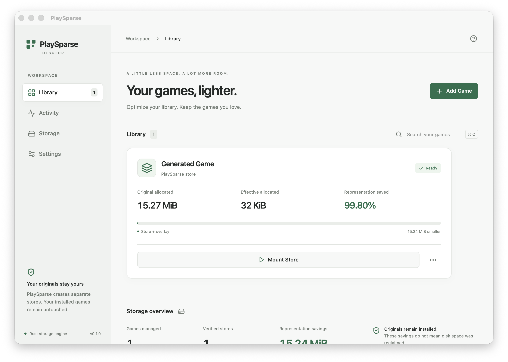

# Desktop milestones — 2026-10-06

Result: a functional development desktop over the existing engine. Production release and broad game compatibility gates remain open. The desktop foundation was merged in [PR #16](https://github.com/gogolumo/PlaySparse/pull/16). [Follow-up PR #17](https://github.com/gogolumo/PlaySparse/pull/17) targets `main` from `feat/playsparse-desktop` with runtime hardening and final native evidence; unrelated research/evidence work is preserved.

| Milestone | Working implementation | Created files | Commits |
|---|---|---|---|
| D1 | Native Tauri app, responsive navigation, original block branding, light/dark/system themes, keyboard shortcuts, error boundary, browser preview | `desktop/src/*`, `desktop/src-tauri/*`, icon assets, Vite/TypeScript configuration | `9331822` |
| D2 | Native folder chooser, safe registration, versioned atomic persistent library, real full Rust analysis, allocation statistics, settings and diagnostics | `crates/playsparse-desktop/*`, reusable `crates/playsparse-cli/src/lib.rs`, native command bridge | `8a05d4e`, `f9cfe6a` |
| D3 | Actual pack/verify callbacks, real stage/byte/file progress, job conflicts, cancellation before publication, capacity preflight, verified result registration, store-location selection | Engine observer APIs, service job orchestration, frontend optimization/activity controls | `8a05d4e`, `f9cfe6a`, `4e60041`, `b13818d` |
| D4 | Managed mounts, verified exact-byte readiness, separate writable overlay, explicit launch descriptors, direct-process tracking, stop/unmount, conservative restart recovery and absence-only stale-session reconciliation | Rust runtime methods, runtime controls, native fixture and opt-in WKWebView harness | `f9cfe6a`, `14e70e1`, `a04e1fa`, `35a521d`, `7468fad`, `9c9bd0b` |
| D5 | Locally produced macOS `.app`/`.dmg`; cross-platform workflows produce Windows NSIS and Linux `.deb`/AppImage development artifacts | `.github/workflows/desktop.yml`, build-sidecar script, packaging/dependency documentation | `4df8801`; remote CI fixes `1675e47`, `d8fba02` integrated without overwriting them |

D4 remains limited: direct children are tracked; launcher descendants, automatic APFS shadows and case translation are not implemented. D5 packages are unsigned development artifacts. Compilation and hosted CI are not physical-machine game compatibility evidence.

## Validation

The final clean native acceptance tested code commit `9c9bd0b0b6d657a8b327f25dfb457314422a026d`. Its receipt says `working_tree_dirty: false`, includes application SHA-256, source file hashes/modes and real job results. The generated source is 16,000,045 logical bytes; original allocation is 16,015,360 bytes. Its verified store and subsequent overlay each allocate 16,384 bytes on this host. The UI counts both representations in effective size. These intentionally repetitive fixture bytes are **not a commercial-game savings benchmark**.

- Rust workspace: 128 passed, three platform/driver tests ignored in the normal run. `cargo fmt --all -- --check` and strict all-feature/all-target Clippy passed.
- Rust desktop portable tests: seven passed, one native-driver test ignored. Real engine flow, exact reads, source preservation, persistence/locking, overlap/traversal, concurrent registration, cancellation at publication, corrupt database retention, redirected runtime paths and interrupted-session recovery are covered.
- Opt-in native Rust service test: passed on installed macFUSE with generated source, exact mounted bytes, overlay separation, fixture executable launch/stop and ordinary unmount.
- Native WKWebView/Tauri IPC acceptance: passed navigation, actual-folder registration, analysis, pack, verify, mount, full exact-byte read, overlay write, launch, stop, unmount and another verification after overlay use. All original file bytes and modes remained unchanged. Native folder-dialog interaction is implemented but is not automated by this harness.
- Existing Python suite: 54 tests, two platform skips, no failures.
- Frontend: TypeScript, ESLint, production build and three Vitest tests passed. Three Playwright tests passed: labeled preview captures, simulated interaction flow and layouts at 1024×700, 1280×800, 1440×900 and 680×520. These are preview tests, separate from native IPC evidence.
- `npm audit`: zero vulnerabilities at validation time.
- Local release-mode development build: `.app` and `.dmg` produced; actual native windows launched and rendered. Bundle hashes are retained below.

Raw native acceptance: [receipt](evidence/native-wkwebview-20261006.json). Local produced artifacts: [hash inventory](evidence/macos-development-bundles-20261006.json). The receipt contains only metadata about generated fixture files, not game assets or binaries.

All three workflows passed on code commit `9c9bd0b`: [desktop build matrix](https://github.com/gogolumo/PlaySparse/actions/runs/37460498459), [runtime validation](https://github.com/gogolumo/PlaySparse/actions/runs/37460498511), and [research checks](https://github.com/gogolumo/PlaySparse/actions/runs/37460498612). The desktop run contains actual `playsparse-development-macos-arm64` (13,293,508 bytes), `playsparse-development-windows-x64` (4,476,073 bytes), and `playsparse-development-linux-x64` (94,549,829 bytes) artifact archives, plus rendered preview screenshots. These are development artifacts, not signed releases. Check the PR for subsequent documentation-head checks; artifacts are identified by their tested code commit.

## Rendered screenshots



[Native empty window](screenshots/native-macos-empty.png), [light reference preview](screenshots/library-light.png), [dark reference preview](screenshots/library-dark.png), [empty preview](screenshots/empty-library.png), [Add Game](screenshots/add-game.png), [analysis](screenshots/analysis-results.png), [optimization progress](screenshots/optimization-progress.png), [settings/diagnostics](screenshots/settings-diagnostics.png). Browser reference captures visibly identify simulated data.

## Run

From the repository:

```sh
cd desktop
npm ci
npm run tauri dev
```

For the visibly simulated browser preview, use `npm run dev` instead. Stop its server before starting native development. Build local installers with `npm run tauri build`. On this Mac, the generated `.app` is under `desktop/src-tauri/target/release/bundle/macos/`; the `.dmg` is under the sibling `dmg/` directory. See [the guide](README.md) for platform prerequisites and the opt-in native acceptance command.

## Remaining gates

Physical Windows/Linux desktop acceptance, signing/notarization, production updates, process-tree monitoring, stronger stale-drive ownership proofs, automated macOS native-code compatibility shadows and case translation, and validated per-title launch descriptors remain incomplete. Engine detection and live cache-usage metrics are unavailable in the desktop UI. Logging retention is configurable and bounded; diagnostic export is not implemented. The original installs remain on disk, and representation savings are never labeled as reclaimed free space.
